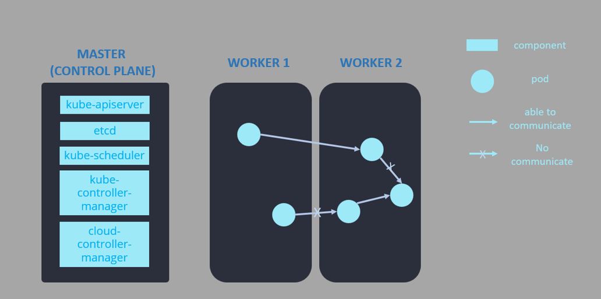

# Deployment (Kubernetes + Calico)

### If you've already work with K8S Cluster. Move to <a href="#help-yourself">Help Yourself</a>

## General Architecture and Setup:

<p align="center"></p>

3 VMWare (Ubuntu 18.04 \<Desktop version\>)
- Control Plane (Master Node): **NAT Network Mode**, 4GB RAM, 2 CPU Processors. IP Address: `192.168.153.169`
- Worker Node 1: **NAT Network Mode**, 2GB RAM, 1 CPU Processors. IP Address: `192.168.153.165`
- Worker Node 2: **NAT Network Mode**, 2GB RAM, 1 CPU Processors. IP Address: `192.168.153.164`

> Note: You should set static IP Address, this instruction will not help you with this. If using dynamic IP (DHCP), don't turn on and off continually or IP may be changed. 

> Don't worry too much. When workers have joined cluster "beautifully", our cluster will update IP address according to changes to our nodes.

Kubernetes networking configuration:
- Cluster pod cidr: 10.48.0.0/16
- Cluster service cidr: 10.49.0.0/16
- Cluster kube-proxy mode: iptables

Calico networking configuration:
- Calico dataplane: Standard Linux networking
- Calico initial IP Pool cidr: 10.48.0.0/24
- Calico initial IP Pool block size: /26 (default)
- Calico initial IP Pool nat mode: enabled (default)
- Calico additional IP Pool cidr: 10.48.1.0/24

### All nodes:

Change hostname rather than `ubuntu`. When a node is created and up, it will has a name with their hostname. Joining the cluster with same name will not work. Altering the hostname as following:

- Master: ubuntu (default)
- Worker1: knode1
- Worker2: knode2

Change hostname by :

```bash
hostnamectl set-hostname <host-name-you-want-to-set>
```

At the same time, add these domain with specific IP above in `/etc/hosts` of each node. All nodes will be available to communicate with each other. 

Master:

```
127.0.0.1       localhost
127.0.1.1       ubuntu

192.168.153.169 ubuntu
192.168.153.164 knode2
192.168.153.165 knode1
```

Worker1:

```
127.0.0.1       localhost
127.0.1.1       knode1

192.168.153.169 ubuntu
192.168.153.164 knode2
192.168.153.165 knode1
```

Worker2:

```
127.0.0.1       localhost
127.0.1.1       knode2

192.168.153.169 ubuntu
192.168.153.164 knode2
192.168.153.165 knode1
```

Now testing if 3 nodes can connect to each other by hostname:

```bash
ping knode1
ping knode2
ping ubuntu
```

Now we are going to "play" with some installations.

1. Always turn off swap partition whenever booting the virtual machine. Otherwise, this could be troubling in some steps

```bash
sudo swapoff -a
```

2. Install required tools, including docker used for containered environment.

```bash
curl -s https://packages.cloud.google.com/apt/doc/apt-key.gpg | sudo apt-key add
sudo apt-add-repository "deb http://apt.kubernetes.io/ kubernetes-xenial main"
sudo apt update -y
sudo apt install -y docker.io watch ipvsadm ipset tcpdump 
```

3. Install main tools used for handling **Kubernetes** environment

```bash
sudo apt install -y kubeadm kubelet kubectl
```

4. Check versions:

```bash
docker --version
kubectl version
kubeadm version
```

5. Enable docker service:

```bash
sudo systemctl enable docker
```

6. Pull the image containing configurations for all needed services

```bash
sudo kubeadm config images pull
```

### Master Node only:

1. Initialize the kubernetes cluster with iptables mode kube-proxy. Configuration file:

```bash 
nano kubeadm-config-iptables-mode.yaml
```

```
---
apiVersion: kubeadm.k8s.io/v1beta2
kind: ClusterConfiguration
networking:
  serviceSubnet: 10.49.0.0/16
  podSubnet: 10.48.0.0/16
  dnsDomain: cluster.local
---
apiVersion: kubeproxy.config.k8s.io/v1alpha1
kind: KubeProxyConfiguration
mode: iptables
```

2. Create the cluster with config above:

```bash
sudo kubeadm init --config kubeadm-config-iptables-mode.yaml
```

There must be something like below at the end of output. This command will help your worker node join the cluster with exact credential in your output terminal.

> Note that  the hash key and K8s token would be different. Save this command immediately !

```bash
kubeadm join 192.168.153.169:6443 --token 0d3aqz.u2bmp0zwlfdh5pmt --discovery-token-ca-cert-hash sha256:726cf64d358aded6a6584271c5342178f10834e254bfe8ff08357dcc3c6af8771
```

3. Copy the kubectl config into `$HOME/.kube`. 

> Kubectl interacts with the kubernetes cluster using the details available in the Kubeconfig file. By default, kubectl looks for the config file in the `$HOME/.kube` location.

```bash
mkdir -p $HOME/.kube
sudo cp -i /etc/kubernetes/admin.conf $HOME/.kube/config
sudo chown $(id -u):$(id -g) $HOME/.kube/config
```

4. Monitor the K8S nodes's status:

```bash
watch kubectl get nodes
kubectl get pods -n kube-system 
```

> Master's status should NOT be ready.

### Worker Node only :

1. Let 2 **Worker** nodes join cluster by command from above as i said before. The command will look like:

```bash
sudo kubeadm join 192.168.153.169:6443 --token 0d3aqz.u2bmp0zwlfdh5pmt --discovery-token-ca-cert-hash sha256:726cf64d358aded6a6584271c5342178f10834e254bfe8ff08357dcc3c6af8771
```

Output if there is no errors:

```
This node has joined the cluster:
* Certificate signing request was sent to apiserver and a response was received.
* The Kubelet was informed of the new secure connection details.

Run 'kubectl get nodes' on the control-plane to see this node join the cluster
```

2. Check the status from monitoring above in `Master node`. 3 nodes's `STATUS` would be `NOT READY`

```bash
kubectl get nodes
```

> If workers don't join successfully. Remembering what we discussed above, nodes with same hostname won't work, rename them.

3. Login to the other workers and repeat steps 1.

### Master Node only:

1. Download Calico configuration files:

```bash
curl https://docs.projectcalico.org/manifests/calico.yaml -o calico.yaml
```

2. Edit the calico-node DaemonSet

```bash
nano calico.yaml
```

3. Change `CALICO_IPV4POOL_CIDR` value to `10.48.0.0/24`; `CALICO_IPV4POOL_IPIP` to `Never`

This section has 2 contents need to be substitute like below:

```yaml
# Enable IPIP
- name: CALICO_IPV4POOL_IPIP
  value: "Never"
```

```yaml
- name: CALICO_IPV4POOL_CIDR
  value: "10.48.0.0/24"
```

4. Apply our config to cluster `calico.yaml`

```bash
kubectl apply -f calico.yaml
``` 

5. Observe the control plane come completely

```bash
watch kubectl get nodes
```

> Wait for a while (quite long :>) for step 4 to be completed. Then our cluster should be `READY`

```
Every 2.0s: kubectl get nodes                             ubuntu: Tue Jun 14 06:53:46 2022

NAME     STATUS   ROLES           AGE     VERSION
knode1   Ready    <none>          5h18m   v1.24.1
knode2   Ready    <none>          5h23m   v1.24.1
ubuntu   Ready    control-plane   5h27m   v1.24.1
```

---

###  Master Node only - Explore Kubernetes with Calico networking:

1. Install and configure `calicoctl`

```bash
curl -O -L  https://github.com/projectcalico/calicoctl/releases/download/v3.14.0/calicoctl
chmod +x calicoctl
sudo mv calicoctl /usr/local/bin
```

2. Create a file `calicoctl.cfg`:

```bash
nano calicoctl.cfg
```

3. Let's add config into :

```bash
apiVersion: projectcalico.org/v3
kind: CalicoAPIConfig
metadata:
spec:
  datastoreType: "kubernetes"
  kubeconfig: "/home/ubuntu/.kube/config"
```

> Note: the key `kubeconfig` is the path `$HOME/.kube/config`

4. Move our config to Calico'service in `/etc` folder.

```bash
sudo mkdir -p /etc/calico
sudo cp calicoctl.cfg /etc/calico
```

5. Check if **Calico** command is good to try:

```bash
calicoctl version
```

## View network's information :

Video demo link: https://youtu.be/EDbifjrOeKM

### Let's begin to look around

1. Check out the Calico node status.

```bash
sudo calicoctl node status
```

Output: 

```
Calico process is running.

IPv4 BGP status
+-----------------+-------------------+-------+----------+-------------+
|  PEER ADDRESS   |     PEER TYPE     | STATE |  SINCE   |    INFO     |
+-----------------+-------------------+-------+----------+-------------+
| 192.168.153.164 | node-to-node mesh | up    | 11:10:52 | Established |
| 192.168.153.165 | node-to-node mesh | up    | 13:20:50 | Established |
+-----------------+-------------------+-------+----------+-------------+

IPv6 BGP status
No IPv6 peers found.
```

2. Verify your IP pool settings

```bash
calicoctl get ippools default-ipv4-ippool -o yaml
```

Output:

```
apiVersion: projectcalico.org/v3
kind: IPPool
metadata:
  creationTimestamp: "2022-06-14T08:45:55Z"
  name: default-ipv4-ippool
  resourceVersion: "2180"
  uid: ece0af99-c0fa-4a46-bc49-0e5c9a9252bd
spec:
  blockSize: 26
  cidr: 10.48.0.0/24
  ipipMode: Never
  natOutgoing: true
  nodeSelector: all()
  vxlanMode: Never
```

3. Check out our IP pool utilization

```bash
calicoctl ipam show
```

```
+----------+--------------+-----------+------------+-----------+
| GROUPING |     CIDR     | IPS TOTAL | IPS IN USE | IPS FREE  |
+----------+--------------+-----------+------------+-----------+
| IP Pool  | 10.48.0.0/24 |       256 | 3 (1%)     | 253 (99%) |
+----------+--------------+-----------+------------+-----------+
```

```bash
calicoctl ipam show --show-blocks
```

```
+----------+--------------+-----------+------------+-----------+
| GROUPING |     CIDR     | IPS TOTAL | IPS IN USE | IPS FREE  |
+----------+--------------+-----------+------------+-----------+
| IP Pool  | 10.48.0.0/24 |       256 | 3 (1%)     | 253 (99%) |
| Block    | 10.48.0.0/26 |        64 | 3 (5%)     | 61 (95%)  |
+----------+--------------+-----------+------------+-----------+
```

## Simple Calico network policy example:

1. Inspect the global network policies

```bash
calicoctl get globalnetworkpolicies
```

2. Download a Firewall policy:

```bash
curl -LO https://raw.githubusercontent.com/xxradar/k8s-calico-oss-onprem-install/master/FirewallZonesPolicies.yaml
```

3. Deploy the zone-based segmentation policies:

```bash
calicoctl apply -f FirewallZonesPolicies.yaml
```

4. Verify the zone-based segmentation policies

```
calicoctl get networkpolicies --all-namespaces
```

5. Going on running some tests. Deploy some pods:

```bash
kubectl run --image nginx nginx --port=80  -l fw-zone=trusted
kubectl  get pods -o wide
```

Output:
```
NAME    READY   STATUS    RESTARTS   AGE     IP            NODE     NOMINATED NODE   READINESS GATES
nginx   1/1     Running   0          4m17s   10.48.0.128   knode1   <none>           <none>
```

- This will run a container with image named `nginx`, port `80`, just let it keep running. Carefully beware of label-value `fw-zone=trusted`.
- **Master** Node defaulty will auto create this pod into `knode1` Worker.

6. Try another container (fail to predefined policy):
```bash
kubectl run -it --rm --image xxradar/hackon hackon  -- bash
```

Once we get into our container with `-it` options as illustrated. Check the running container `nginx` above by `curl` its content pages by its IP shown in pod above. Type:

```bash
curl 10.48.0.128
``` 

There should be no respond from the container. This because our policy kicked in. You can open another terminal to view all current pods 

```bash
kubectl get pods -o wide
```

7. Try another container (pass predefined policy):

```bash
kubectl run -it --rm --image xxradar/hackon -l fw-zone=dmz hackon -- bash
```
Run again:

```bash
curl 10.48.0.128
``` 

This should be successful. It prints out the contents of nginx's webpage.


### Adding a new ippool for a specific namespace (Bonus):

```bash
calicoctl apply -f 10.48.1.0-ippool.yaml
kubectl create namespace internal-ns
kubectl annotate namespace internal-ns "cni.projectcalico.org/ipv4pools"="[\"new-pool\"]" --overwrite
kubectl run nginx --image nginx --namespace internal-ns
```

## Further demonstration:

You can add more pods between Worker 1 and Worker 2 and set more rules/policies to observe the result. Happy testing !!!!

## Help yourself:

1. If you need to **reset** cluster in below case:
- Redo `kubeadm init`
- Redo `kubeadm join`

You could use the following command:
```
sudo kubeadm reset # --cri-socket=unix://var/run/cri-dockerd.sock
```

2. If there are multiple **CRI Socket**, you must specify which socket you're using by `--cri-socket=YOUR_SOCKET`. `YOUR_SOCKET` format should be `unix:/SOCKETPATH`. Available `YOUR_SOCKET` are located in `/var/run`, you could use this to list the available:

```
sudo ls /var/run | grep -E ".sock$"
```

## Reference:

Main link: [xxradar-k8s-calico-oss-onprem-deploy](https://github.com/xxradar/k8s-calico-oss-onprem-install)

- Kubeadm Install: https://docs.projectcalico.org/getting-started/kubernetes/quickstart
- Kube-Proxy Mode: https://www.projectcalico.org/comparing-kube-proxy-modes-iptables-or-ipvs/
- Calico IPAM: https://docs.projectcalico.org/networking/ipam
- Intro Calico eBPF dataplane: https://www.projectcalico.org/introducing-the-calico-ebpf-dataplane/
- CNCF Calico eBPF webinar: https://www.cncf.io/webinars/calico-networking-with-ebpf/
- Trying Calico eBPF dataplane: https://docs.projectcalico.org/getting-started/kubernetes/trying-ebpf
